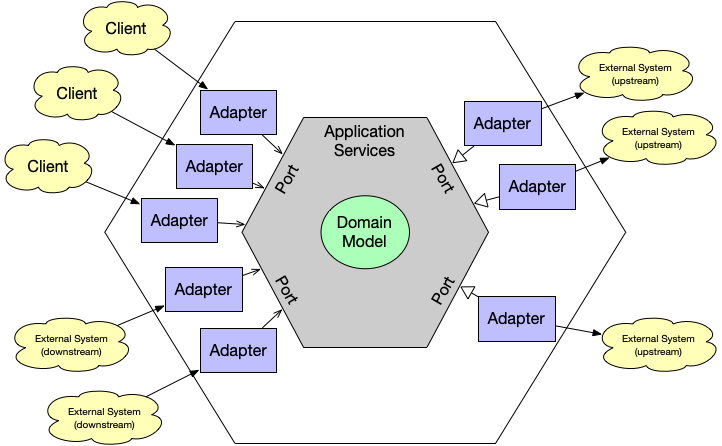

# 섹션 5 키워드
## 1. Layered Architecture vs Hexagonal Architecture

### Layered Architecture
- 클라이언트의 요청이 controller => service => domain 순으로 계층적으로 타고 들어가는 구조로 애플리케이션을 개발하는 방식
- Layered Architecture 단점 : 도메인 객체가 하위 Infra Layer와 너무 강하게 의존관계가 맺어져 있음(특히, 데이터베이스 / JPA)
- 작은 시스템인 경우 빠르고 이해하기 쉬운 Layered Architecture를 사용하는것을 추천

### Hexagonal Architecture

- Hexagonal Architecture : Layered Architecture의 단점을 해결하기 위해 제시된 Architecture
- 도메인 객체가 외부와 완전히 분리됨 (JPA라는 구현기술을 몰라도 된다.)
- 클라이언트는 Adapter와 Port를 통해 Domain에 접근한다.
- 멀티 모듈로 구성해야 하는 서비스라면 Hexagonal Architecture을 사용하는것 추천

---

## 2. 단위 테스트 vs 통합 테스트

---

## 3. IoC, DI, AOP

---

## 4. ORM, 패러다임 불일치, Hibernate

---

## 5. Spring Data JPA

---

## 6. @SpringBootTest vs @DataJpaTest

---

## 7. @SpringBootTest vs @WebMvcTest

---

## 8. @Transactional(readOnly = true) 

---

## 9. 동시성 처리 방법 (Optimistic Lock, Pessimistic Lock)

---

## 10. CQRS

---

## 11. Spring Bean Validation 차이
- 각 도메인, 컨트롤러 단에서 검증해야 하는 요구사항 차이를 이해하자
- 컨트롤러에서는 최소한의 검증을 수행할 수 있게 책임을 분리하자
---

## 12. @RestControllerAdvice, @ExceptionHandler 어노테이션 개념

---

## 13. Mock, Mockito, @MockBean 개념

---

## 14. ObjectMapper 의 직렬화 역직렬화
